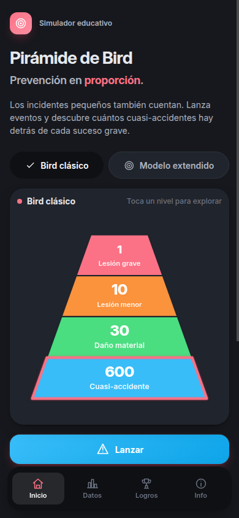
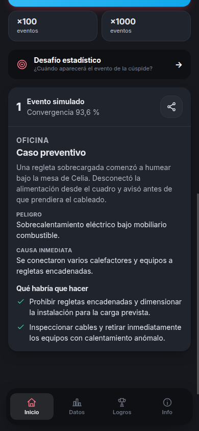

# Pirámide de Bird Simulador

Aplicación móvil educativa, gratuita y en español para explorar de forma visual la relación estadística entre cuasi accidentes, daños y lesiones. Permite ejecutar simulaciones individuales o por lotes, observar la convergencia de los resultados, consultar escenarios preventivos y aprender mediante desafíos y logros.

La aplicación está pensada como apoyo para formación y sensibilización en prevención de riesgos laborales (PRL). No sustituye una evaluación de riesgos, una investigación de accidentes, una norma técnica ni el criterio de un profesional competente.

<table>
  <tr>
    <td align="center">
      
      <br />
      <sub>Pirámide interactiva y simulación</sub>
    </td>
    <td align="center">
      
      <br />
      <sub>Resultado y medidas preventivas</sub>
    </td>
  </tr>
</table>

## Qué incluye

- Lanzamiento visual que recorre los símbolos y colores de los posibles sucesos antes de detenerse en el resultado.
- Pirámide interactiva, simulaciones de 1, 100 o 1000 eventos y comparación entre resultados teóricos y observados.
- 80 casos preventivos de ocho sectores, con peligro, causa inmediata y medidas recomendadas.
- Historial, estadísticas, desafío probabilístico y logros guardados en el dispositivo.
- Funcionamiento sin conexión, tema claro/oscuro, movimiento reducido y navegación accesible por teclado o lector de pantalla.
- Aplicación web instalable dentro del proyecto Android mediante Capacitor, sin cuentas, publicidad ni compras.

## Modelos educativos

- **Bird clásico:** 600 cuasi accidentes, 30 daños materiales, 10 lesiones menores y 1 lesión grave o incapacitante.
- **Adaptación didáctica:** 600 cuasi accidentes, 30 lesiones menores, 10 lesiones graves y 1 fatalidad.

La adaptación didáctica no es la formulación histórica de Bird. Se incluye para explicar eventos de baja frecuencia y alto impacto, y se identifica como tal dentro de la aplicación. Las simulaciones representan probabilidades teóricas; no predicen cuándo ocurrirá un accidente real ni permiten estimar el riesgo de una empresa o tarea concreta.

## Requisitos

- Node.js 22 o posterior.
- npm.
- Para Android: Android Studio y un SDK de Android compatible con Capacitor.

## Desarrollo local

Instala las dependencias:

```bash
npm install
```

Inicia el servidor de desarrollo:

```bash
npm run dev
```

Ejecuta las pruebas:

```bash
npm run test
```

Genera la compilación web de producción:

```bash
npm run build
```

Sincroniza la compilación web y los plugins con el proyecto Android:

```bash
npx cap sync android
```

Abre el proyecto nativo en Android Studio:

```bash
npx cap open android
```

Antes de sincronizar Android después de un cambio web, ejecuta de nuevo `npm run build`.

La separación entre dominio, persistencia, adaptadores nativos e interfaz se explica en la [documentación de arquitectura](docs/architecture.md).

## Configuración de Firebase

El repositorio incluye la integración y mantiene Analytics y Crashlytics desactivados por defecto. Para activar la telemetría consentida en una compilación propia:

1. Crea una aplicación Android en Firebase con el identificador `com.breixopd.piramidebird`.
2. Copia su archivo `google-services.json` en `android/app/google-services.json`; el archivo está excluido de Git.
3. Configura en Firebase/Google Analytics una retención de datos de usuario y eventos de 2 meses.
4. Ejecuta `npm run cap:sync` y genera de nuevo la aplicación Android.
5. Verifica en un dispositivo que no se recibe ningún evento antes de aceptar, que los eventos aparecen tras aceptar y reiniciar, y que dejan de aparecer tras retirar el consentimiento y reiniciar de nuevo.

Si el archivo no existe o Firebase no está disponible, la compilación pública sigue funcionando sin telemetría. No añadas claves de firma ni archivos Firebase al repositorio.

## Privacidad y funcionamiento sin conexión

El núcleo de la aplicación funciona sin conexión. El historial, los ajustes, el progreso y los logros se guardan localmente en el dispositivo.

Firebase Analytics y Firebase Crashlytics permanecen desactivados hasta que la persona usuaria presta un consentimiento explícito. Si acepta, una instalación puede enviar eventos de uso, identificadores de instalación y diagnósticos técnicos que después se muestran en informes agregados; no se envían relatos consultados, historial de simulaciones, estimaciones del desafío ni datos introducidos por la persona usuaria. El consentimiento puede retirarse desde los ajustes.

La exportación y el uso del menú nativo para compartir solo se ejecutan por iniciativa de la persona usuaria. Consulta la [política de privacidad](docs/privacy-policy.md) para conocer todos los detalles.

## Piloto y publicación

El proceso de entrega previsto es:

1. Comprobar tipos, pruebas y compilación web.
2. Generar una APK `release` firmada fuera de la automatización pública, exclusivamente para el piloto descargable.
3. Publicar la APK como _prerelease_ de GitHub junto con su suma SHA-256 y advertir que puede requerir desinstalación antes de instalar una versión procedente de Google Play.
4. Validar el piloto con profesionales de PRL y personas en formación siguiendo la [guía de pruebas](docs/pilot-testing.md).
5. Corregir incidencias críticas o de contenido antes de generar el AAB final.
6. Publicar manualmente en Google Play mediante Play App Signing: el equipo conserva la clave de carga y Google protege la clave que firma las APK entregadas. Las pruebas destinadas a actualizarse hasta producción deben distribuirse desde la pista interna de Play.

Los fallos funcionales se pueden comunicar mediante la plantilla **Informe de error** de GitHub Issues. Las dudas o correcciones preventivas deben usar **Revisión de contenido PRL**.

## Alcance inicial

La primera versión está orientada a Android y a español de España. Es gratuita, no incluye publicidad, cuentas, compras, sonidos ni notificaciones. iOS y otros modelos históricos quedan fuera de esta primera entrega.

## Contacto

Proyecto mantenido por [breixopd](https://github.com/breixopd) en [breixopd/piramide-bird-simulador](https://github.com/breixopd/piramide-bird-simulador). Para soporte, privacidad o sugerencias, abre una incidencia en [GitHub Issues](https://github.com/breixopd/piramide-bird-simulador/issues).
